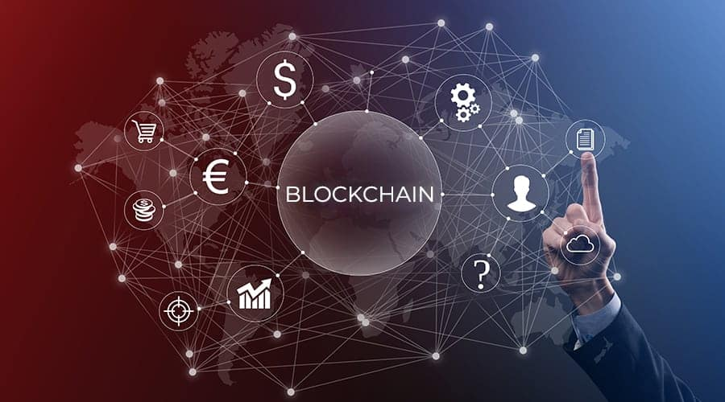

https://www.notion.so/Blockchain-Developer-65b33cd732a042aeaed8d55909f1d493
# Blockchain Developer

Blockchain technology is poised to revise how the digital world handles data and business.  Created as a platform for supporting Bitcoin, Blockchain is establishing a position of versatility and screen that has made numerous spots of business and government take notice and begin putting it to their use

I have created a detailed roadmap to becoming a blockchain developer. I have curated the list of resources from different sources.

Milestones:-

# 1. Introduction to blockchain - (basic)

[Basic Blockchain Knowledge](https://www.notion.so/909c881153ab470790bd0825bd372114)

# 2. Stepping up Blockchain knowledge

[Intermediate blockchain ](https://www.notion.so/fc6ac9774d894871a10c04de4fd57ff6)

# 3. L1, L2 Blockchains

[More about blockchains](https://www.notion.so/792103b31d6a4a6796d0895a2dd300e4)

# Blockchain Development:

## 4. Blockchain Oracles

[Oracles](https://www.notion.so/376792112a854a8ab788db21d29dea7b)

## 5. Blockchain Dev tools and Smart Contract

[Smart Contracts](https://www.notion.so/a16b276006b1483c9c47865903b9b48e)

# Security

[Security and Mangement Platforms](https://www.notion.so/b91e4fd7f700470ba3cbd18b70d227ed)

# ****Frontend Frameworks****

[Web3 Frontend Frameworks](https://www.notion.so/3e0feba25d4e479d831344ca370b2f6d)

# Decentralized Applications

A decentralised application (dApp) is an application that can operate autonomously through the use of smart contracts that run on a blockchain. Like traditional applications, dApps provide some function or utility to their users.

[Decentralized Applications (Dapps)](https://www.notion.so/804bdada43b349ea936c0e5a2b839c46)

## Client Libraries

You can write only some smart contracts in your project from scratch. Many open-source smart contract libraries are available that provide reusable building blocks for your project that can save you from reinventing the wheel.

[Untitled](https://www.notion.so/28bf763b07dc4e63a7c0cb3634ff7bde)

---

## Client Nodes

A blockchain is a distributed network of computers (known as nodes) running software that can verify blocks and transaction data. The software application, known as a client, must be run on your computer to turn it into a blockchain node.

[Untitled](https://www.notion.so/2705de5283d3440ebafac16762f78e8e)

## More about Dapps

[Untitled](https://www.notion.so/144c76edadcc454bbdfb2062c08f28f8)

## Applications of DApps:

dApps can be used for just about anything requiring two or more parties to agree. When the appropriate conditions are met, the smart contract will execute automatically. An important differentiation is that these transactions are no longer based on trust, but they are rather based on cryptographically-backed smart contracts.

[Untitled](https://www.notion.so/625d94f9d30544e4962022e69fcf900d)

## ****Node as a Service (NaaS):****

Running your own blockchain node can be challenging, especially when getting started or while scaling fast. There are a number of services that run optimized node infrastructures for you, so you can focus on developing your application or product instead.

**[Blockchain Node Providers and How They Work](https://www.infoq.com/articles/blockchain-as-a-service-get-block/)**

[Untitled](https://www.notion.so/79896ad4116a4ab196be67a4b0ef0c7a)

# ****Building for Scale****

Due to the limited number of transactions-per-second (TPS) built-in to blockchains, a number of alternative mechanism and technologies have emerged to aid the scaling of blockchain dApps.
**[Blockchain Node Providers and How They Work](https://www.infoq.com/articles/blockchain-as-a-service-get-block/)**

[Untitled](https://www.notion.so/9e006d05a5274a0698b0edd6228241fa)
